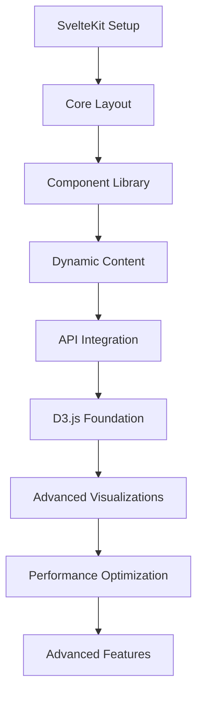

# Main Site Feature Roadmap

## Implementation Phases

### Phase 2.1: Foundation and Core Layout (Current Session)

**Timeline**: Session 2
**Status**: In Progress

#### Deliverables

- [x] **Project Documentation**: Technical decisions, development guidelines, deployment strategy
- [ ] **SvelteKit Project Setup**: Basic project structure with TypeScript
- [ ] **Core Layout**: Root layout with navigation and responsive design
- [ ] **Landing Page Foundation**: Basic hero section and content structure
- [ ] **Component Library**: Base UI components (Button, Card, Navigation)
- [ ] **Development Environment**: Docker setup and local development workflow

#### Success Criteria

- Application builds and runs successfully
- Basic navigation between pages works
- Responsive design functions on mobile and desktop
- Development environment is fully functional
- Code quality tools are configured and passing

### Phase 2.2: Content and Basic Features (Session 3)

**Timeline**: Session 3
**Dependencies**: Phase 2.1 completion

#### Deliverables

- **Hero Section**: Professional introduction with key value propositions
- **About Section**: Professional background and contact information
- **Current Task**: Summary banner describing current agent task
- **Project Showcase Foundation**: Static project cards with basic information
- **Navigation Enhancement**: Smooth scrolling and active state indicators
- **SEO Foundation**: Meta tags, structured data, sitemap

#### Success Criteria

- Landing page content is complete and professional
- About section provides comprehensive professional information
- Current task showcase pulls from ../docs/agent/current-task.md set during last working session
- Project showcase displays static content effectively
- SEO metadata is properly configured
- Site passes accessibility audits

### Phase 2.3: Dynamic Content and API Integration (Session 4)

**Timeline**: Session 4
**Dependencies**: Phase 2.2 completion

#### Deliverables

- **GitHub API Integration**: Real-time repository statistics and contribution data
- **Dynamic Project Data**: Project information loaded from external sources
- **Contact Form**: Functional contact form with validation and submission
- **Blog Integration**: Latest blog posts displayed on landing page
- **Error Handling**: Comprehensive error states and loading indicators

#### Success Criteria

- GitHub data loads and displays correctly
- Contact form functions properly with validation
- Blog integration shows latest posts
- Error states provide clear user feedback
- Loading states indicate progress to users

### Phase 2.4: Data Visualization Foundation (Session 5)

**Timeline**: Session 5
**Dependencies**: Phase 2.3 completion

#### Deliverables

- **D3.js Integration Setup**: Basic D3.js component framework
- **Skills Visualization**: Interactive skills radar chart
- **Technology Stack Display**: Visual representation of technology proficiencies
- **Performance Metrics**: Basic site performance monitoring dashboard
- **Responsive Visualizations**: Charts adapt to different screen sizes

#### Success Criteria

- D3.js visualizations render correctly
- Skills radar chart is interactive and informative
- Visualizations are responsive across devices
- Performance metrics display real data
- Charts maintain accessibility standards

### Phase 3.1: Advanced Visualizations (Session 6)

**Timeline**: Session 6
**Dependencies**: Phase 2.4 completion

#### Deliverables

- **Experience Timeline**: Interactive chronological view of technology adoption
- **Project Technology Mapping**: Network graph connecting projects to technologies
- **Competency Metrics**: Data-driven skill assessment visualization
- **Interactive Data Playground**: User-configurable data visualizations
- **Animation and Transitions**: Smooth animations for visual elements

#### Success Criteria

- Complex visualizations perform well with real data
- Interactive features respond smoothly to user input
- Animations enhance user experience without hindering performance
- Data playground demonstrates visualization capabilities
- All visualizations maintain professional appearance

### Phase 3.2: Performance and Optimization (Session 7)

**Timeline**: Session 7
**Dependencies**: Phase 3.1 completion

#### Deliverables

- **Performance Optimization**: Bundle size optimization and code splitting
- **Image Optimization**: WebP conversion and lazy loading implementation
- **Caching Strategy**: Intelligent API response and asset caching
- **Core Web Vitals**: Optimization for LCP, FID, and CLS metrics
- **Progressive Enhancement**: Ensure functionality without JavaScript

#### Success Criteria

- Performance budgets are met (<200KB JS, <50KB CSS)
- Core Web Vitals scores are excellent (LCP <2.5s, FID <100ms, CLS <0.1)
- Images load efficiently with proper optimization
- Site functions with JavaScript disabled
- Caching reduces API calls and improves responsiveness

### Phase 3.3: Advanced Features and Polish (Session 8)

**Timeline**: Session 8
**Dependencies**: Phase 3.2 completion

#### Deliverables

- **Dark/Light Mode**: Theme switching with user preference persistence
- **Advanced Interactions**: Hover effects, focus states, and micro-interactions
- **Analytics Integration**: Privacy-respecting user behavior tracking
- **A/B Testing Framework**: Infrastructure for continuous optimization
- **Accessibility Enhancements**: WCAG 2.1 AA compliance validation

#### Success Criteria

- Theme switching works seamlessly across the site
- Interactions provide clear feedback and enhance user experience
- Analytics capture meaningful user behavior data
- A/B testing framework enables data-driven improvements
- Site passes comprehensive accessibility audits

## Feature Prioritization Matrix

### High Priority (Must Have)

- **Professional Landing Page**: Essential for first impressions
- **Project Showcase**: Core portfolio functionality
- **Responsive Design**: Critical for mobile users
- **Performance**: Essential for user experience and SEO
- **Accessibility**: Required for professional standards

### Medium Priority (Should Have)

- **Data Visualizations**: Demonstrates technical capabilities
- **API Integrations**: Shows real-time data handling
- **Contact Form**: Enables professional inquiries
- **SEO Optimization**: Important for discoverability
- **Error Handling**: Professional user experience

### Low Priority (Nice to Have)

- **Dark Mode**: Enhanced user preference support
- **Advanced Animations**: Visual polish and engagement
- **Analytics**: Data-driven optimization insights
- **A/B Testing**: Continuous improvement framework
- **Interactive Playground**: Advanced capability demonstration

## Technical Dependencies

### Internal Dependencies

### External Dependencies

- **GitHub API**: For repository and contribution data
- **Blog Platform API**: For blog post integration
- **Cloudflare Pages**: For deployment and edge features
- **Analytics Service**: For user behavior tracking
- **Email Service**: For contact form functionality

## Risk Assessment and Mitigation

### Technical Risks

**Risk**: D3.js learning curve impact on timeline
**Probability**: Medium
**Impact**: High
**Mitigation**: Start with simple visualizations, allocate extra time for complex features

**Risk**: Performance budget constraints with D3.js
**Probability**: Medium
**Impact**: Medium
**Mitigation**: Implement code splitting, lazy loading, and progressive enhancement

**Risk**: Responsive design complexity with visualizations
**Probability**: Low
**Impact**: Medium
**Mitigation**: Test early and often on multiple devices, use flexible design patterns

### External Dependencies Risks

**Risk**: GitHub API rate limiting
**Probability**: Low
**Impact**: Medium
**Mitigation**: Implement caching, error handling, and fallback content

**Risk**: Cloudflare Pages limitations
**Probability**: Low
**Impact**: High
**Mitigation**: Design within platform constraints, prepare backup deployment option

## Success Metrics

### Technical Metrics

- **Performance**: Core Web Vitals scores in "Good" range
- **Accessibility**: WCAG 2.1 AA compliance score >95%
- **Code Quality**: Test coverage >80%, linting passing
- **Bundle Size**: JavaScript <200KB, CSS <50KB (compressed)

### User Experience Metrics

- **Loading Time**: <2 seconds initial load on 3G connection
- **Engagement**: Time on site >2 minutes average
- **Conversion**: Contact form completion rate >5%
- **Retention**: Return visitor rate >20%

### Professional Impact Metrics

- **Portfolio Effectiveness**: Leads to interview opportunities
- **Technical Demonstration**: Showcases modern development practices
- **Learning Achievement**: Successful adoption of SvelteKit and D3.js
- **Industry Recognition**: Positive feedback from data engineering community

## Continuous Improvement Plan

### Regular Reviews

- **Weekly**: Progress against roadmap milestones
- **Bi-weekly**: Performance metrics and user feedback
- **Monthly**: Technical debt assessment and optimization opportunities
- **Quarterly**: Feature prioritization and roadmap updates

### Feedback Integration

- **User Testing**: Regular usability testing with target audience
- **Performance Monitoring**: Continuous monitoring of Core Web Vitals
- **Code Reviews**: Peer review of all significant changes
- **Community Feedback**: Engagement with data engineering community

This roadmap provides a structured approach to building a comprehensive, professional portfolio site that effectively demonstrates data engineering expertise while maintaining excellent user experience and technical standards.
